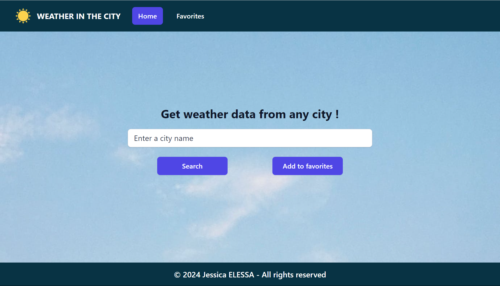

# weather-app-react-tailwind-client

## Table of Contents

- [Demo](#demo)
- [Stack](#stack)
- [Screenshot](#screenshot)
- [Main features](#main-features)
- [Run the project locally](#run-the-project-locally)
- [Getting started with Vite](#getting-started-with-vite)
- [Contributing](#contributing)
- [Stay Updated](#stay-updated)
- [Contact](#contact)

## Demo

You can see a live demo of the project [here](https://jesselessa-weather-app-react-tailwind.netlify.app/).

## Stack

This project has been created with React using Vite Tool and Tailwind CSS.

The weather data are fetched from OpenWeatherMap API, whose documentation can be found [here](https://openweathermap.org/api).

## Screenshot

## Main features

- Get weather data for any city in the world.
- Save the weather data of a favorite city.
- Display the weather data of a default city on the homepage.

## Run the project locally

1. Open your terminal and navigate to the location where you want the local repository to be copied.
2. Clone the repository : `git clone https://github.com/jesselessaweather-app-react-tailwind-client.git`
3. Navigate to the project directory : `cd weather-app-react-tailwind-client`
4. Inside the project directory :
    - Run the application in development mode : `npm run dev`
    - Open http://localhost:3000 in your web browser to view the development server.

## Getting Started with Vite

## Contributing

- If you are interested in contributing, explore the project structure in the 'src' folder and modules installed in the 'package.json' file.
- Feel free to make improvements, fix bugs, or suggest new features. Contibutions are welcomed !

## Stay updated

To stay updated with the project latest changes, you can pull them from the repository : `git pull origin main`

## Contact

For inquiries, you can contact me via [LinkedIn](https://www.linkedin.com/in/jessica-elessa/).

---

&copy; 2024, Jessica ELESSA - All rights reserved
