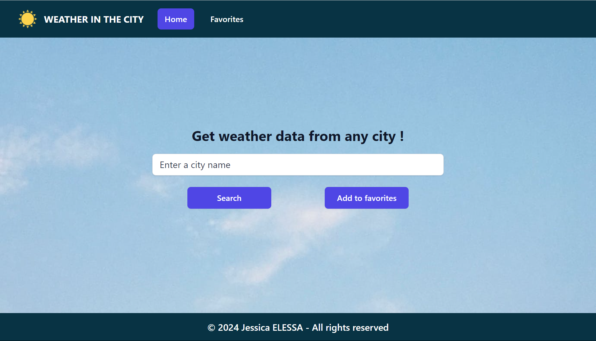

# weather-app-react-node

This project is a weather application that can collect and save data from any city in the world.

## Table of Contents

- [Demo](#demo)
- [Stack](#stack)
  - [Frontend](#frontend)
  - [Backend](#backend)
- [Screenshot](#screenshot)
- [Main features](#main-features)
- [Run the project locally](#run-the-project-locally)
- [Getting started with Vite](#getting-started-with-vite)
- [Contributing](#contributing)
- [Stay Updated](#stay-updated)
- [Contact](#contact)

## Demo

You can see a live demo of the project [here](https://weather-app.jesselessa.dev).

## Stack

### Frontend

This project was created with **React** using **Vite** for rapid development and **Tailwind CSS** for styling.

The navigation in the application was managed by **React Router**.

### Backend

The API has been created with **Node.js** and **Express**.

The weather data are fetched from **OpenWeatherMap API**, the documentation of which can be found [here](https://openweathermap.org/api)

## Screenshot

## Main features

- Get weather data for any city in the world.
- Save weather data of a favorite city.
- Display weather data of a default city on the homepage.
- Change background image depending on displayed city weather.

## Run the project locally

1. Open your terminal and navigate to the location where you want the local repository to be copied
2. Clone the repository : `git clone https://github.com/jesselessa/weather-app-react-node.git`
3. Navigate to the project directory : `cd weather-app-react-node`
4. Copy the `.env.example` file from the `backend` folder, and rename it to `.env`. Fill in the required environment variables.
5. Install the dependencies necessary to the project inside each folder by running `npm install`.
6. Then :
   - Inside the `client` folder, run the application in development mode : `npm run dev`.
   - Inside the `backend` folder, start the server and launch the database : `npm start`.
7. Finally, open `http://localhost:5173` in your web browser to view the live application.

**Important: Do not commit your `.env` file containing sensitive information (API keys, secrets) to a public repository. Add them to your `.gitignore` file**

## Getting Started with Vite

[Vite](https://vitejs.dev/) is a fast development tool for modern web applications. To get started with Vite, follow these simple steps :

### 1. Install Node.js and npm

Ensure you have Node.js and npm installed on your system. You can download and install them from the [official Node.js website](https://nodejs.org/en).

### 2. Initialize the project

If you have not already created a project, you can initialize a new project using the following command in your terminal : `npm init vite@latest my-project --template react`.

This command will create a new directory named `my-project` and install a Vite project with a React template in it.

### 3. Install dependencies

Once the project is initialized, navigate to the newly created directory (`cd my-project`) and install the dependencies by running the command `npm install`.

### 4. Start the development server

To start the development server, use the command `npm run dev`.

This will launch Vite and automatically open your default browser to http://localhost:5173, where you can see your live application.

### 5. Deploy to production

To build an optimized version of your application ready for production, use the command `npm run build`.

This will generate a production-ready version of your application in the `dist` directory of your project.

## Contributing

If you are interested in contributing to the project, explore its structure in the `src` folder and modules installed in the `package.json` file.

Feel free to make improvements, fix bugs, or suggest new features. Contributions are welcomed !

## Stay updated

To stay updated with the project latest changes, you can pull them from the repository : `git pull origin main`

## Contact

For inquiries, you can contact me via [LinkedIn](https://www.linkedin.com/in/jesselessa/).

---

&copy; 2024, Jessica ELESSA - All rights reserved
